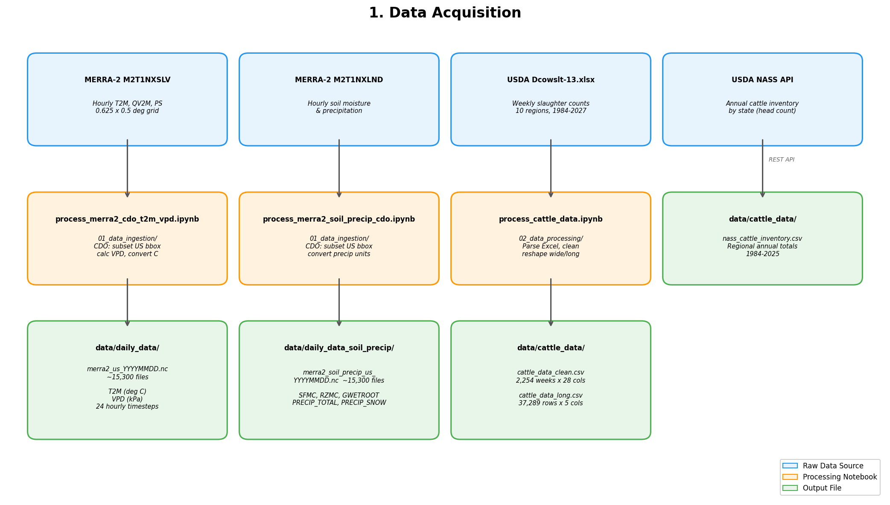
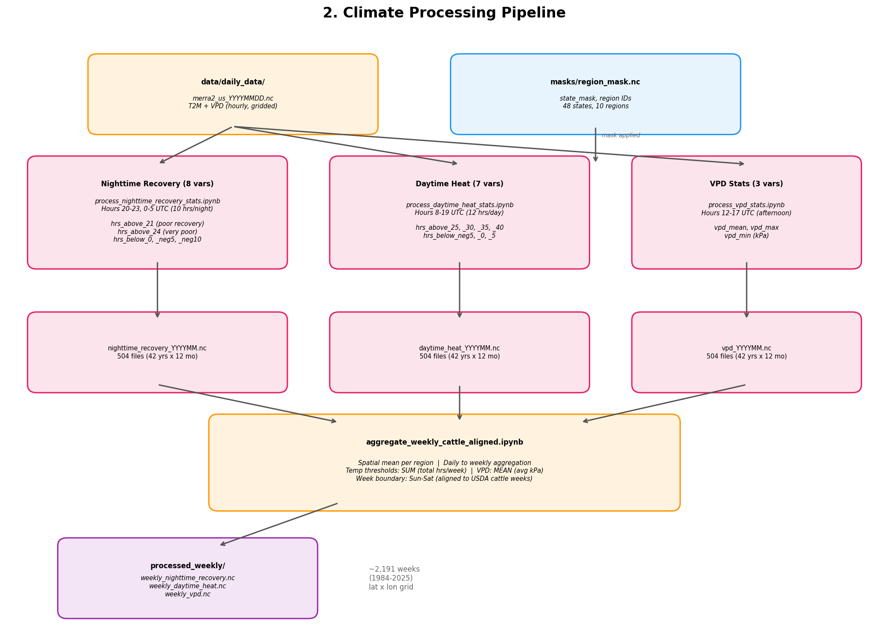
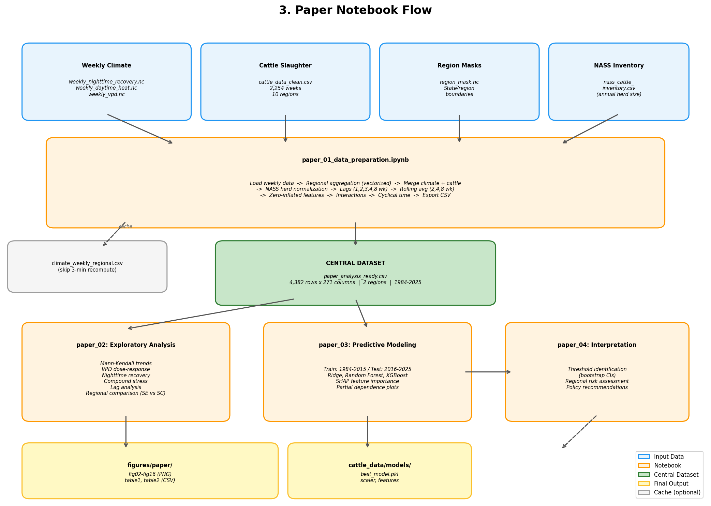
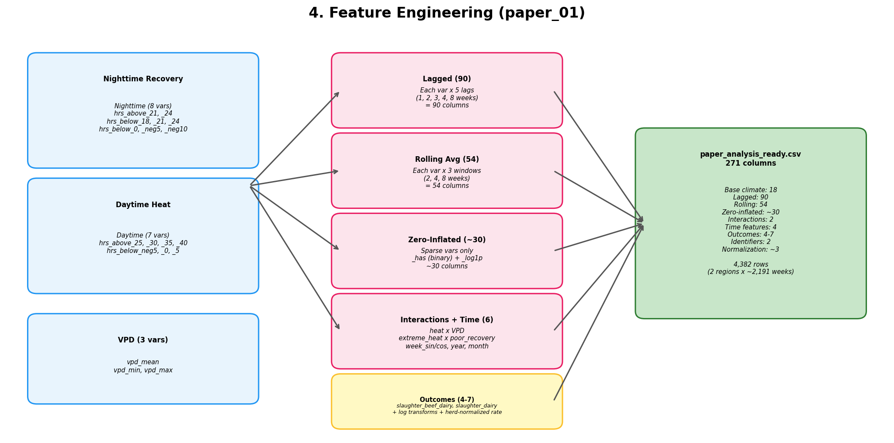

# Data Pipeline Documentation

End-to-end data flow from raw MERRA-2 and USDA sources through processing to paper analysis outputs.

---

## 1. Data Acquisition

Raw data sources and the notebooks that ingest them into local NetCDF/CSV files.

---

## 2. Climate Processing Pipeline

Daily gridded files are reduced to threshold-based metrics, then aggregated to weekly regional means.

---

## 3. Paper Notebook Flow

Weekly climate + cattle data flow through the paper analysis pipeline.

---

## 4. Feature Engineering Detail (paper_01)

How 18 base climate variables expand to 271 analysis columns.

---

*Diagrams generated by `generate_pipeline_diagrams.py` in this directory.*
